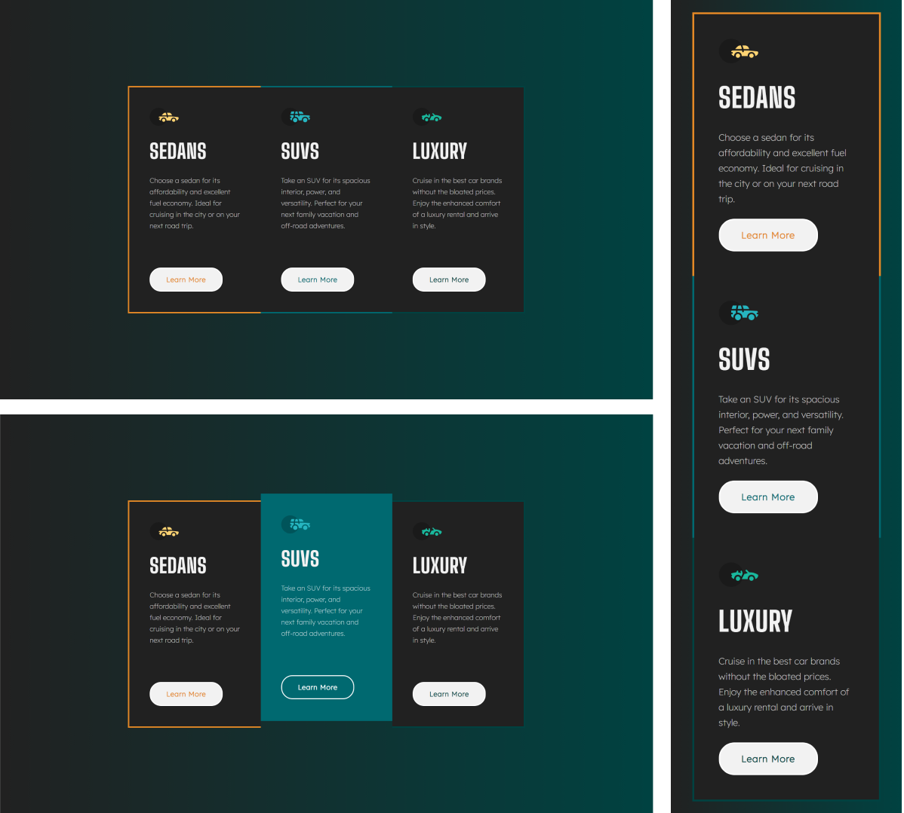

# Frontend Mentor - 3-column preview card component solution

Essa é uma resolução para o [desafio do 3-Column card component do Frontend Mentor](https://www.frontendmentor.io/challenges/3column-preview-card-component-pH92eAR2-). Os desafios do Frontend Mentor te ajudam a aprimorar suas habilidades de código, baseado na criação de projetos realistas.

## [📃💻 Website view 🖱🖥](https://souzasantosk.github.io/Frontend-Mentor/3-Column%20Card%20Component/)

## Summary / Sumário

- [Overview](#overview)
  - [Screenshot](#screenshot)
  - [Links](#links)
- [My process](#my-process)
  - [Built with](#built-with)
  - [What I learned](#what-i-learned)
  - [Useful resources](#useful-resources)
- [Author](#author)

## Overview

Aqui você encontrará a minha resolução do desafio do Order Summary Card Component.

### Screenshot

#### Results preview

### Links

- Solution URL: [Frontend Mentor](https://www.frontendmentor.io/solutions/3-column-card-component-with-html-css-and-hover-animations-th_V7PDlNR)
- Live Site URL: [Github pages](https://souzasantosk.github.io/Frontend-Mentor/3-Column%20Card%20Component/)

## My process

### Built with

- HTML 5
- CSS custom properties
- CSS @media responsivity
- Pseudo-elements
- Flexbox
- Mobile-first workflow

### What I learned

Esse projeto acabou fugindo um pouco do modelo fornecido inicialmente, mas eu particularmente gostei do resultado. Utilizei um pouco mais de pseudo-elements e acabou ficando até que bem interativo e animado.

### Useful Resources

- [UIverse](https://uiverse.io/) - Site com centenas de modelos feitos pela comunidade. Desde botões até formulários, ótimo para ter referência e inspirações além de ser bom para praticar a criação de animações interativas.

## Author

<!-- - Website - [@Kaua de Souza](#) -->

- Github - [@SantosSouzaK](https://github.com/SouzaSantosK)
- Frontend Mentor - [@Kaua de Souza](https://www.frontendmentor.io/profile/SouzaSantosK)
