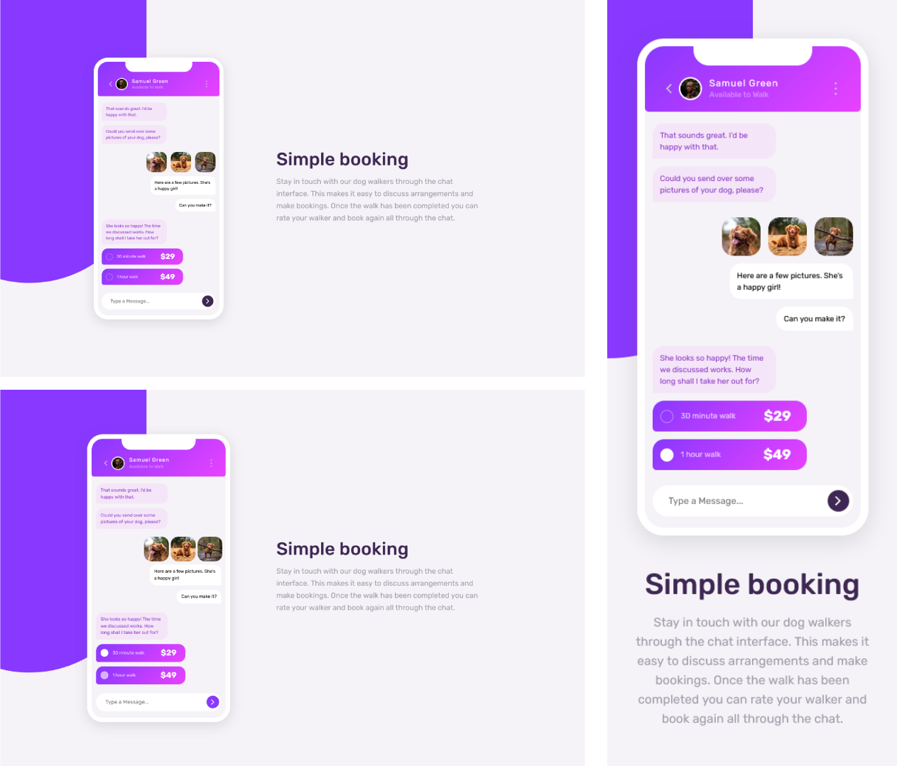

# Frontend Mentor - Chat app CSS illustration solution

Essa é uma resolução para o [desafio do Chat app CSS illustration do Frontend Mentor](https://www.frontendmentor.io/challenges/chat-app-css-illustration-O5auMkFqY). Os desafios do Frontend Mentor te ajudam a aprimorar suas habilidades de código, baseado na criação de projetos realistas.

## [📃💻 Website view 🖱🖥](https://souzasantosk.github.io/Frontend-Mentor/Chat%20App%20Illustration)

## Table of contents

- [Overview](#overview)
  - [Screenshot](#screenshot)
  - [Links](#links)
- [My process](#my-process)
  - [Built with](#built-with)
  - [What I learned](#what-i-learned)
  - [Useful resources](#useful-resources)
- [Author](#author)
- [Acknowledgments](#acknowledgments)

## Overview

### Screenshot

### Links

- Solution URL: [Frontend Mentor](#)
- Live Site URL: [Github pages](https://souzasantosk.github.io/Frontend-Mentor/Chat%20App%20Illustration)

## My process

### Built with

- CSS custom properties
- Flexbox
- Mobile-first workflow
- CSS @media responsivity

### What I learned

Desafio de certa forma simples, serviu mais de treino para a criação de objetos complexos com HTML e CSS, nesse caso, a tela de um celular. Aproveitei para tentar resolver esse desafio mais rápido e ter uma ideia do tempo médio que deveria ser gasto em projetos dessa escala.

### Useful Resources

[CSS-Tricks Inputs e Labels](https://css-tricks.com/html-inputs-and-labels-a-love-story/) - Explica a relação entre inputs e labels, e como isso melhora a acessibilidade.

## Author

- Github - [@SantosSouzaK](https://github.com/SouzaSantosK)
- Frontend Mentor - [@Kaua de Souza](https://www.frontendmentor.io/profile/SouzaSantosK)
