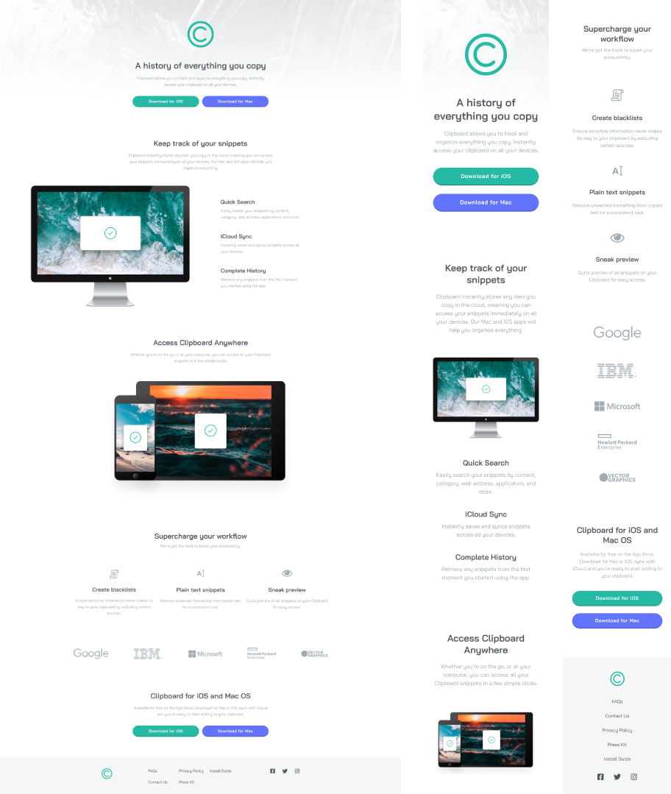

# Frontend Mentor - Clipboard landing page solution

Essa é uma resolução para o [desafio do Clipboard landing page do Frontend Mentor](https://www.frontendmentor.io/challenges/clipboard-landing-page-5cc9bccd6c4c91111378ecb9). Os desafios do Frontend Mentor te ajudam a aprimorar suas habilidades de código, baseado na criação de projetos realistas.

## [📃💻 Website view 🖱🖥](https://souzasantosk.github.io/Frontend-Mentor/Clipboard%20Landing%20Page)

## Table of contents

- [Overview](#overview)
  - [Screenshot](#screenshot)
  - [Links](#links)
- [My process](#my-process)
  - [Built with](#built-with)
  - [What I learned](#what-i-learned)
  - [Continued development](#continued-development)
- [Author](#author)

## Overview

### Screenshot

### Links

- Solution URL: [Frontend Mentor](https://www.frontendmentor.io/solutions/clipboard-landing-page-with-html-and-css-with-responsivity-my2QL3Rws-)
- Live Site URL: [Github pages](https://souzasantosk.github.io/Frontend-Mentor/Clipboard%20Landing%20Page)

## My process

### Built with

- Semantic HTML5 markup
- CSS custom properties
- Flexbox
- CSS Grid
- Mobile-first workflow
- @media query responsivity

### What I learned

Tentei dedicar menos tempo nesse desafio, tendo em vista que já passei muito tempos nos outros. Serviu como reforço do que foi feito nas outras landing pages, mesmo tendo gasto menos tempo, espero ter escrito com qualidade de código maior ou semelhante aos anteriores.

### Continued development

Partiu finalizar os outros desafios de HTML e CSS e ingressar no JS. Quero me sentir confiante na parte de estruturação da página, para poder manipulá-la sem medo. 😎

## Author

- Github - [@SantosSouzaK](https://github.com/SouzaSantosK)
- Frontend Mentor - [@Kaua de Souza](https://www.frontendmentor.io/profile/SouzaSantosK)
