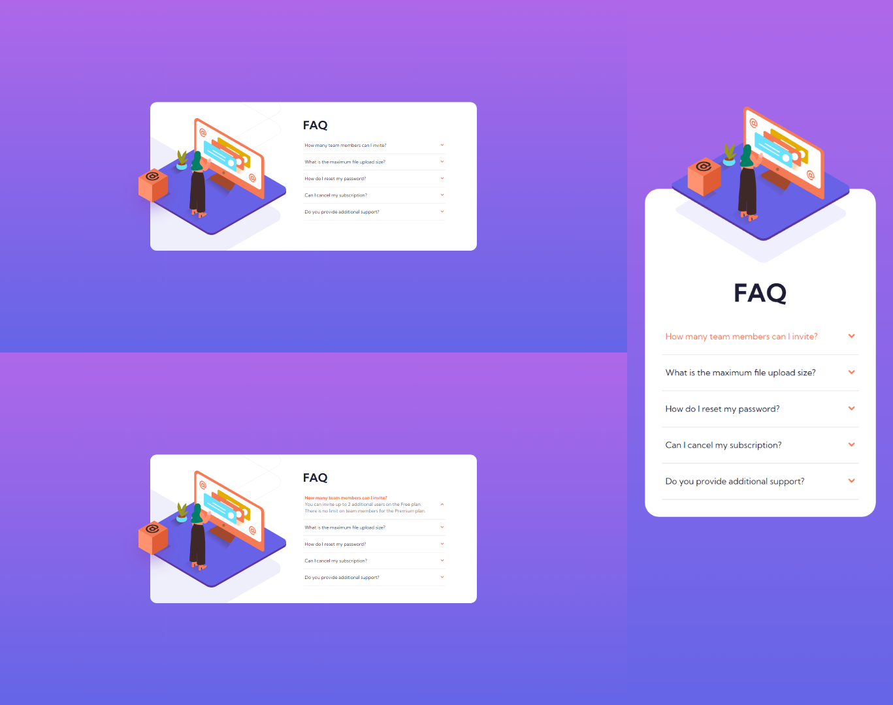

# Frontend Mentor - FAQ accordion card solution

Essa é uma resolução para o desafio [FAQ accordion card challenge on Frontend Mentor](https://www.frontendmentor.io/challenges/faq-accordion-card-XlyjD0Oam). Os desafios do Frontend Mentor te ajudam a aprimorar suas habilidades de código, baseado na criação de projetos realistas.

## [📃💻 Website view 🖱🖥](https://souzasantosk.github.io/Frontend-Mentor/FAQ%20Accordion%20Card)

## Table of contents

- [Overview](#overview)
  - [Screenshot](#screenshot)
  - [Links](#links)
- [My process](#my-process)
  - [Built with](#built-with)
- [Author](#author)

**Note: Delete this note and update the table of contents based on what sections you keep.**

## Overview

### Screenshot

### Links

- Solution URL: [Frontend Mentor](https://www.frontendmentor.io/solutions/faq-accordion-card-Vp3rP5AQeF)
- Live Site URL: [Github pages](https://souzasantosk.github.io/Frontend-Mentor/FAQ%20Accordion%20Card)

## My process

### Built with

- Semantic HTML5 markup
- CSS custom properties
- Flexbox
- CSS Grid
- Mobile-first workflow
- @media query responsivity

## Author

- Github - [@SantosSouzaK](https://github.com/SouzaSantosK)
- Frontend Mentor - [@Kaua de Souza](https://www.frontendmentor.io/profile/SouzaSantosK)
