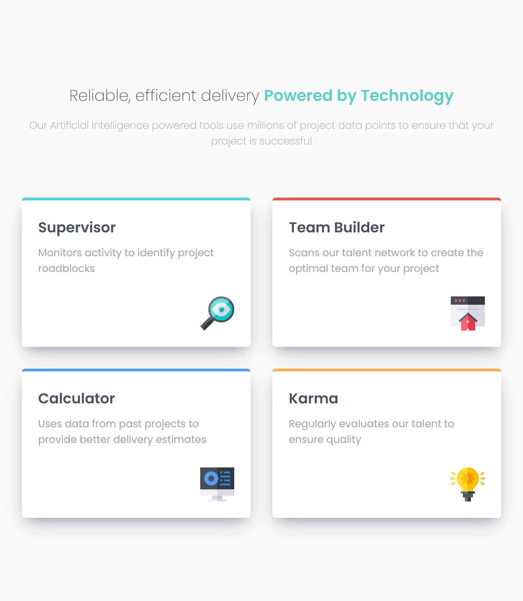

# Frontend Mentor - Four card feature section solution

Essa é uma resolução para o [desafio do Four Card Feature Section](https://www.frontendmentor.io/challenges/four-card-feature-section-weK1eFYK). Os desafios do Frontend Mentor te ajudam a aprimorar suas habilidades de código, baseado na criação de projetos realistas.

## [📃💻 Website view 🖱🖥](https://souzasantosk.github.io/Frontend-Mentor/Four%20Card%20Featured%20Section)

## Table of contents

- [Overview](#overview)
  - [Screenshot](#screenshot)
  - [Links](#links)
- [My process](#my-process)
  - [Built with](#built-with)
  - [What I learned](#what-i-learned)
  - [Continued development](#continued-development)
  - [Useful resources](#useful-resources)
- [Author](#author)

## Overview

### Screenshot


### Links

- Solution URL: [Frontend Mentor](#)
- Live Site URL: [Github pages](https://souzasantosk.github.io/Frontend-Mentor/Four%20Card%20Featured%20Section)

## My process

### Built with

- Semantic HTML5 markup
- CSS custom properties
- Flexbox
- CSS Grid
- Mobile-first workflow

---

### What I learned

Esse desafio foi "curioso", pois de primeira vista eu achava que era simples, mas nunca deve-se basear somente no que você vê, é preciso pensar por debaixo dos panos, e quando eu fiz isso, confesso que fiquei um pouco confuso. Mas resumindo, eu aprendi como é possivel e em quais contextos são interessantes de se trabalhar com displays diferentes (flex e grid) em um mesmo elemento, dependendo da situação e suas necessidades:

Nesse trecho (que se refere ao display de uma tela mobile), eu uso a propriedade display flex, pois ela é muito mais dinâmica quando há um elemento maior (card-board), que agrupa todos os outros em uma única coluna.

```html
<div class="card-board">
  <div class="card supervisor"></div>

  <div class="center">
    <div class="card builder"></div>
    <div class="card karma"></div>
  </div>

  <div class="card calculator"></div>
</div>
```

```css
.card-board {
  display: flex;
  flex-direction: column;
  gap: 2rem;
}
```

Mas a situação muda, quando eu quero que meus elementos se adaptem a resolução da tela e mudem suas posições fora da ordem já definida no HTML, então é que aí surge um problema, no qual o "display: flex" e "flex-direction: row" não poderiam resolver (até onde eu sei). Onde, por causa da "div center", não seria possível o flex passar o "card calculator" para o lado esquerdo de uma forma que resulte em duas colunas e duas linhas.


Para isso, eu uso o "display: grid" e "grid-template-areas" para poder fazer essa manipulação, permitindo que eu posicione os elementos na ordem que eu desejar, pela quantidade de linhas e colunas necessárias, sem que afetem uns aos outros.

```css
@media (min-width: 768px) and (max-width: 1150px) {
  .card-board {
    display: grid;
    grid-template-areas:
      "supervisor builder-karma"
      "calculator builder-karma";
  }

  .supervisor {
    grid-area: supervisor;
  }

  .center {
    grid-area: builder-karma;
  }

  .calculator {
    grid-area: calculator;
  }
}
```



E após passar do tamanho de 1150px, eu transformo o "card-board" em "display flex" novamente.

_*Provavelmente, você pensaria em "Por que ele não usou display grid desde o início, e quando a tela ultrapassasse 1150px, era só transformar em um grid de 3 colunas e alinhar as duas imagens das pontas ao centro (verticalmente) e pronto, tá resolvido."*_

Concordo plenamente com esse raciocínio e até cogitei fazer dessa forma, mas eu quis testar, mesmo que de forma superficial e simples, como podemos trabalhar de forma dinâmica, com diversas propriedades que não só o CSS, mas outras linguages ou até ferramentas nos proporcionam. Acredito também que esse tipo de visão, sobre as diversas interpretações e formas de resolver determinados problemas, nos permitem ter uma visão mais ampla e raciocínio mais claro. Além de que é bom ser teimoso e curioso de vez em quando😃.

---

### Continued development

Fiz uma seção de aprendizado tão grande, que é dificil dizer mais alguma coisa, mas deixo essa parte aqui para me referir a uma outra seção de [Desenvolvimento contínuo](../Testimonials%20Grid%20Section/README.md/#continued-development) de outro desafio meu, em que eu digo "Além de que a sintaxe, principalmente no CSS começou a ficar confusa para quem possa lê-la no futuro." E venho nesse desafio, comentar que estou melhorando essas práticas.

#### Antes...

```css
.card-board > .card:first-child {
  border-top-color: var(--cyan);
}

.card-board .center .card:first-child {
  border-top-color: var(--red);
}

.card-board .center .card:last-child {
  border-top-color: var(--orange);
}

.card-board > .card:last-child {
  border-top-color: var(--blue);
}
```

#### Depois...

```css
.card-board .supervisor {
  border-top-color: var(--cyan);
}

.card-board .builder {
  border-top-color: var(--red);
}

.card-board .karma {
  border-top-color: var(--orange);
}

.card-board .calculator {
  border-top-color: var(--blue);
}
```

Meio simples demais, mas acho que é um bom começo.

### Useful resources

- [Grid Layout - Origamid](https://www.origamid.com/projetos/css-grid-layout-guia-completo/) - Documentação sobre todas as principais propriedades do display grid, completamente em português.

## Author

- Github - [@SantosSouzaK](https://github.com/SouzaSantosK)
- Frontend Mentor - [@Kaua de Souza](https://www.frontendmentor.io/profile/SouzaSantosK)
