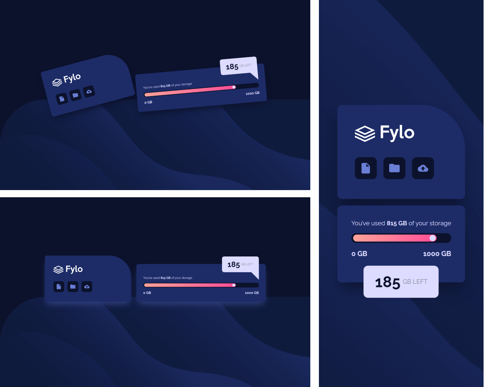

# Frontend Mentor - Fylo data storage component solution

Essa é uma resolução para o [desafio do Fylo Data Storage Component do Frontend Mentor](https://www.frontendmentor.io/challenges/fylo-data-storage-component-1dZPRbV5n). Os desafios do Frontend Mentor te ajudam a aprimorar suas habilidades de código, baseado na criação de projetos realistas.

## [📃💻 Website view 🖱🖥](https://souzasantosk.github.io/Frontend-Mentor/Fylo%20Data%20Storage%20Component/)

## Table of contents

- [Overview](#overview)
  - [Screenshot](#screenshot)
  - [Links](#links)
- [My process](#my-process)
  - [Built with](#built-with)
  - [What I learned](#what-i-learned)
- [Author](#author)

## Overview

### Screenshot

### Links

- Solution URL: [Frontend Mentor](#)
- Live Site URL: [Github pages](https://souzasantosk.github.io/Frontend-Mentor/Fylo%20Data%20Storage%20Component/)

## My process

### Built with

- Semantic HTML5 markup
- CSS custom properties and pseudo-elements
- Flexbox
- Mobile-first workflow
- CSS animations (extra)

### What I learned

Projeto também, relativamente simples, reforcei alguns conceitos sobre posicionamento de elementos, como o ::after e ::before, e como bônus deixei uma animação um pouco divertida para a versão desktop da página.

### Useful resources

## Author

- Github - [@SantosSouzaK](https://github.com/SouzaSantosK)
- Frontend Mentor - [@Kaua de Souza](https://www.frontendmentor.io/profile/SouzaSantosK)
