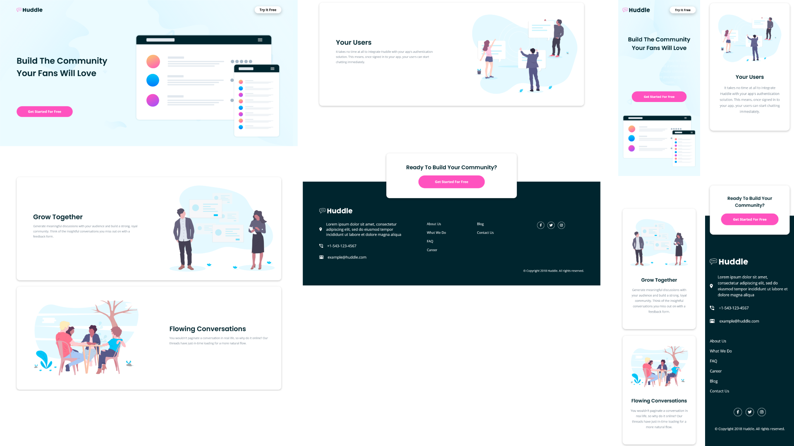

# Frontend Mentor - Huddle landing page with alternating feature blocks solution

Essa é uma resolução para o [desafio do Huddle landing page with alternating feature blocks do Frontend Mentor](https://www.frontendmentor.io/challenges/huddle-landing-page-with-alternating-feature-blocks-5ca5f5981e82137ec91a5100). Os desafios do Frontend Mentor te ajudam a aprimorar suas habilidades de código, baseado na criação de projetos realistas.

## [📃💻 Website view 🖱🖥](https://souzasantosk.github.io/Frontend-Mentor/Huddle%20Landing%20Page%20Alternating%20Feature%20Blocks)

## Table of contents

- [Overview](#overview)
  - [Screenshot](#screenshot)
  - [Links](#links)
- [My process](#my-process)
  - [Built with](#built-with)
- [Author](#author)

## Overview

### Screenshot

### Links

- Solution URL: [Frontend Mentor](https://www.frontendmentor.io/solutions/huddle-landing-page-alternate-feature-blocks-yjMhp_phyc)
- Live Site URL: [Github pages](https://souzasantosk.github.io/Frontend-Mentor/Huddle%20Landing%20Page%20Alternating%20Feature%20Blocks)

## My process

### Built with

- Semantic HTML5 markup
- CSS custom properties
- Flexbox
- CSS Grid
- Mobile-first workflow

## Author

- Github - [@SantosSouzaK](https://github.com/SouzaSantosK)
- Frontend Mentor - [@Kaua de Souza](https://www.frontendmentor.io/profile/SouzaSantosK)
