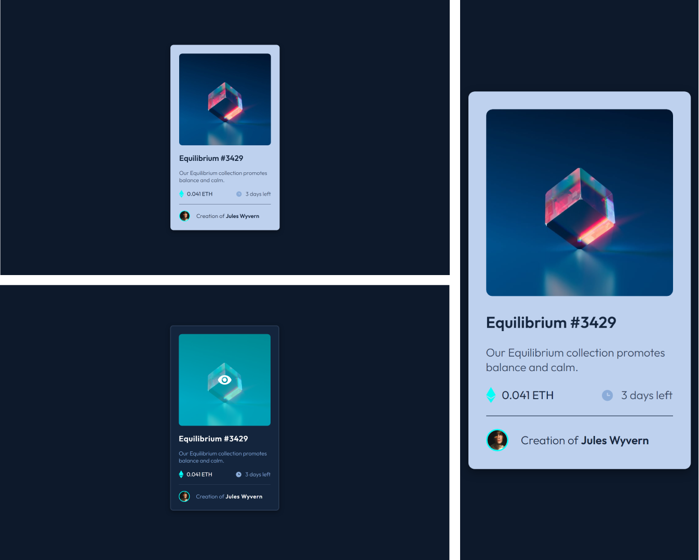

# Frontend Mentor - NFT preview card component solution

Essa é uma resolução para o [desafio do NFT card component](https://www.frontendmentor.io/challenges/nft-preview-card-component-SbdUL_w0U). Os desafios do Frontend Mentor te ajudam a aprimorar suas habilidades de código, baseado na criação de projetos realistas.

## [📃💻 Website view 🖱🖥](#)

## Summary / Sumário

- [Overview / Visão geral](#overview)
  - [Screenshot](#screenshot)
  - [Links](#links)
- [My process / Meu processo](#my-process)
  - [Built with / Construido com...](#built-with)
  - [What I learned / O que aprendi](#what-i-learned)
  - [Continued development / Desenvolvimento contínuo](#continued-development)
  - [Useful resources / Recursos úteis](#useful-resources)
- [Author / Autor](#author)
  
## Overview

Aqui você encontrará a minha resolução do desafio do NFT Card component.

### The challenge

O usuário deve ser capaz de:

- Visualizar o layout ideal da página dependendo do tamanho da tela de seu dispositivo
- Perceber animações dos estados de hover e focus para elementos interativos.

### Screenshot

#### Results preview

### Links

- Solution URL: [Frontend Mentor](#)
- Live Site URL: [Github pages](#)

## My process

### Built with

- HTML 5
- CSS custom properties
- CSS @media responsivity
- CSS hover effect and pseudo-element
- Flexbox
- Mobile-first workflow

### What I learned

Nesse projeto, tentei "abusar" um pouco mais das animações de interação com o mouse do CSS, tentando deixar o card mais animado, em vez de completamente estático. Aprendi a como usar de forma básica a propriedade "::after", e percebi o quanto ela pode ser poderosa na hora de gerar novos elementos dentro de um mesmo.

### Continued development

Continuo nessa saga de desenvolvimento web, enquanto posto essa resolução já estou trabalhando em novas, e pretendo continuar ir mais e mais fundo em meus projetos.

### Useful resources

- [CSS pseudo-elements](https://www.w3schools.com/css/css_pseudo_elements.asp) - Explicação com exemplos sobre pseudo-elementos.
- [CSS ::after](https://www.w3schools.com/cssref/sel_after.php) - Definição simples sobre o ::after

## Author

<!-- - Website - [@Kaua de Souza](#) -->

- Github - [@SantosSouzaK](https://github.com/SouzaSantosK)
- Frontend Mentor - [@Kaua de Souza](https://www.frontendmentor.io/profile/SouzaSantosK)