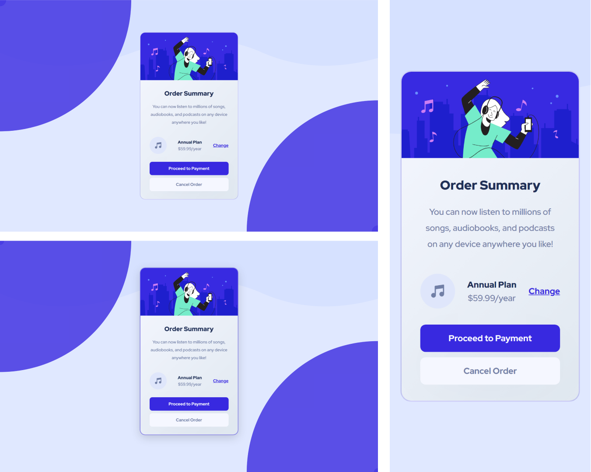

# Frontend Mentor - QR Code component solution

Essa é uma resolução para o [desafio do Order summary do Frontend Mentor](https://www.frontendmentor.io/challenges/order-summary-component-QlPmajDUj). Os desafios do Frontend Mentor te ajudam a aprimorar suas habilidades de código, baseado na criação de projetos realistas.

## [📃💻 Website view 🖱🖥](https://souzasantosk.github.io/Frontend-Mentor/Order%20Summary%20Component/)

## Summary / Sumário

- [Overview](#overview)
  - [Screenshot](#screenshot)
  - [Links](#links)
- [My process](#my-process)
  - [Built with](#built-with)
  - [What I learned](#what-i-learned)
  - [Continued development](#continued-development)
  - [Useful resources](#useful-resources)
- [Author](#author)

## Overview

Aqui você encontrará a minha resolução do desafio do Order Summary Card Component.

### Screenshot

#### Results preview

### Links

- Solution URL: [Frontend Mentor](https://www.frontendmentor.io/solutions/order-summary-component-with-html-and-css-cool-animation-for-desktop-sCtubA1tkB)
- Live Site URL: [Github pages](https://souzasantosk.github.io/Frontend-Mentor/Order%20Summary%20Component/)

## My process

### Built with

- HTML 5
- CSS custom properties
- CSS @media responsivity
- CSS @keyframes
- Flexbox
- Mobile-first workflow

### What I learned

Esse projeto foi tranquilo de ser realizado. Sofri mais para encaixar as animações de forma responsiva, pois quando eu mexia na background image ou os círculos em uma dimensão de tela, acabavam ficando distorcidos em outras. Então aprendi um pouco melhor sobre position absolute e fixed, e mais sobre pseudo-elements (::before, ::after).

### Continued development

Mais um desafio para minha lista, pretendo continuar o que já foi dito anteriormente. Rumo ao topo!

## Author

<!-- - Website - [@Kaua de Souza](#) -->

- Github - [@SantosSouzaK](https://github.com/SouzaSantosK)
- Frontend Mentor - [@Kaua de Souza](https://www.frontendmentor.io/profile/SouzaSantosK)
