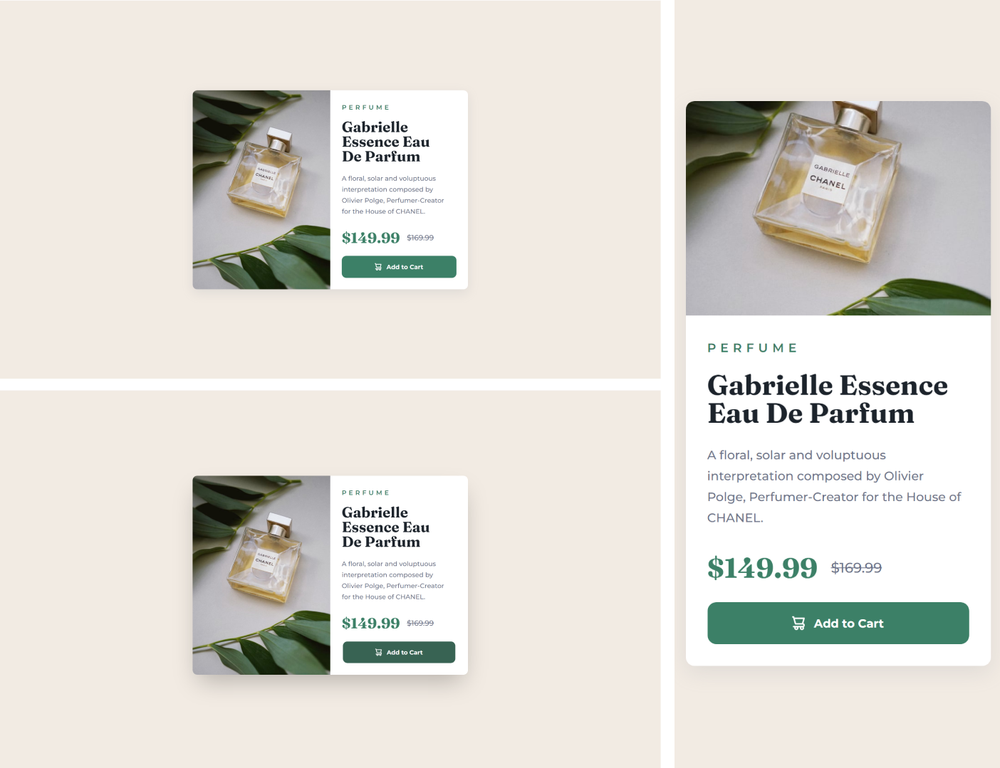

# Frontend Mentor - Product preview card component solution

Essa é uma resolução para o [desafio do Product Card Component](https://www.frontendmentor.io/challenges/product-preview-card-component-GO7UmttRfa). Os desafios do Frontend Mentor te ajudam a aprimorar suas habilidades de código, baseado na criação de projetos realistas.

## [📃💻 Website view 🖱🖥](#)

## Table of contents

- [Overview / Visão geral](#overview)
  - [Screenshot](#screenshot)
  - [Links](#links)
- [My process / Meu processo](#my-process)
  - [Built with / Construido com...](#built-with)
  - [What I learned / O que aprendi](#what-i-learned)
  - [Continued development / Desenvolvimento contínuo](#continued-development)
  - [Useful resources / Recursos úteis](#useful-resources)
- [Author / Autor](#author)

## Overview

Aqui você encontrará a minha resolução do desafio do Product Card component.

### The challenge

O usuário deve ser capaz de:

- Visualizar o layout ideal da página dependendo do tamanho da tela de seu dispositivo
- Perceber animações dos estados de hover e focus para elementos interativos.

### Screenshot



### Links

- Solution URL: [Frontend Mentor](https://www.frontendmentor.io/solutions/product-card-component-with-html-and-css-mobilefirst-grid-layout-f1kVK_G3wk)
- Live Site URL: [Github pages](https://souzasantosk.github.io/Frontend-Mentor/Product%20Card%20Component/)

## My process

### Built with

- Semantic HTML5 markup
- CSS custom properties and animations
- CSS @media responsivity
- Flexbox and Grid layout
- Mobile-first workflow

### What I learned

Nesse projeto, eu revisei alguns conceitos sobre posicionamento de texto, espaçamento entre elementos, e manipulação do sistema de grid. Optei por usar esse sistema por ser mais dinâmico e responsivo em relação ao flexbox (que também foi utilizado), e encaixar perfeitamente com o layout desse desafio.

```css
.card {
  display: grid;
  grid-template-columns: 1fr;
}

@media (min-width: 768px) {
  .card {
    grid-template-columns: repeat(2, 1fr);
    width: 600px;
  }
}
```

### Continued development

Não sei em qual ordem esse desafio deveria estar, mas ele é considerado iniciante (newbie) pela plataforma, e que logo me chamou a atenção. Nesse desafio eu gostei bastante das animações que são possíveis fazer utilizando apenas o CSS, e pretendo aproveitar melhor essas ferramentas.

### Useful resources

- [CSS Animations](https://css-tricks.com/almanac/properties/a/animation/) - Pequena introdução à criação de @keyframes para fazer animações em CSS.

## Author

<!-- - Website - [@Kaua de Souza](#) -->

- Github - [@SantosSouzaK](https://github.com/SouzaSantosK)
- Frontend Mentor - [@Kauã de Souza](https://www.frontendmentor.io/profile/SouzaSantosK)
