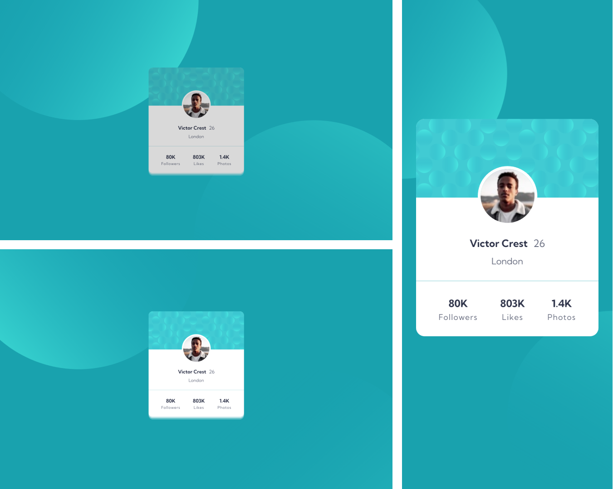

# Frontend Mentor - Profile card component solution

Essa é uma resolução para o [Profile card component challenge on Frontend Mentor](https://www.frontendmentor.io/challenges/profile-card-component-cfArpWshJ). Os desafios do Frontend Mentor te ajudam a aprimorar suas habilidades de código, baseado na criação de projetos realistas.

## [📃💻 Website view 🖱🖥](https://souzasantosk.github.io/Frontend-Mentor/Profile%20Card%20Component/)

## Table of contents

- [Overview](#overview)
  - [Screenshot](#screenshot)
  - [Links](#links)
- [My process](#my-process)
  - [Built with](#built-with)
  - [What I learned](#what-i-learned)
  - [Useful resources](#useful-resources)
- [Author](#author)

## Overview

### Screenshot

### Links

- Solution URL: [Frontend Mentor](https://www.frontendmentor.io/solutions/profile-card-component-with-html-and-css-xWCZrDfJc2)
- Live Site URL: [Github pages](https://souzasantosk.github.io/Frontend-Mentor/Profile%20Card%20Component/)

## My process

### Built with

- Semantic HTML5 markup
- CSS custom properties
- Flexbox
- Mobile-first workflow

### What I learned

Nesse desafio sofri um pouco em relação ao posicionamento da imagem do usuário (colocá-lo entre a background-image e o plano de fundo padrão), além das imagens posicionadas nos cantos da página, com pseudo-elementos, terem me dado trabalho na hora da responsividade, então tive que me aprofundar um pouco mais sobre propriedades de posicionamento.

### Useful resources

- [Background position](https://css-tricks.com/almanac/properties/b/background-position/) - Me ajudou a entender como funcionam as propriedades de posicionamento de background-images.
- [Element position](https://css-tricks.com/almanac/properties/p/position/) - Me deu maior conhecimento teórico sobre os tipos de posicionamento que um elemento pode ter, e como cada um se comporta dentro de um layout.

## Author

<!-- - Website - [@Kaua de Souza](#) -->

- Github - [@SantosSouzaK](https://github.com/SouzaSantosK)
- Frontend Mentor - [@Kaua de Souza](https://www.frontendmentor.io/profile/SouzaSantosK)
