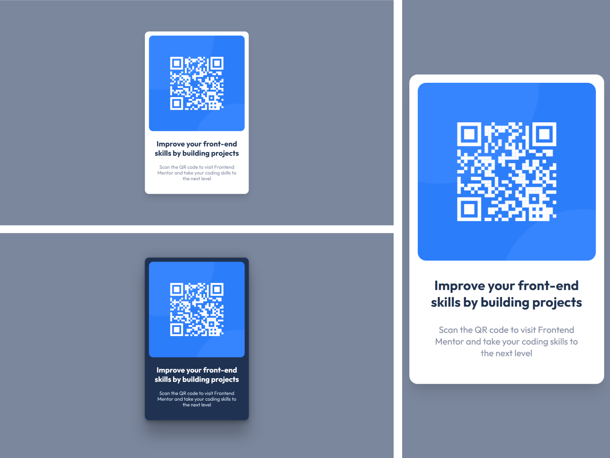
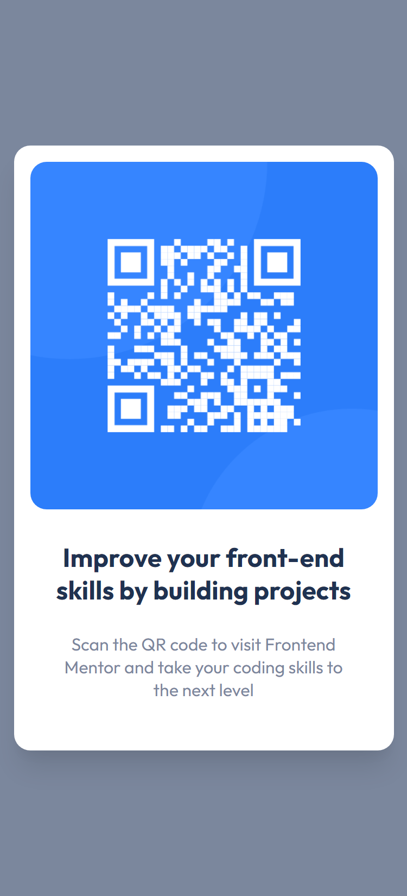
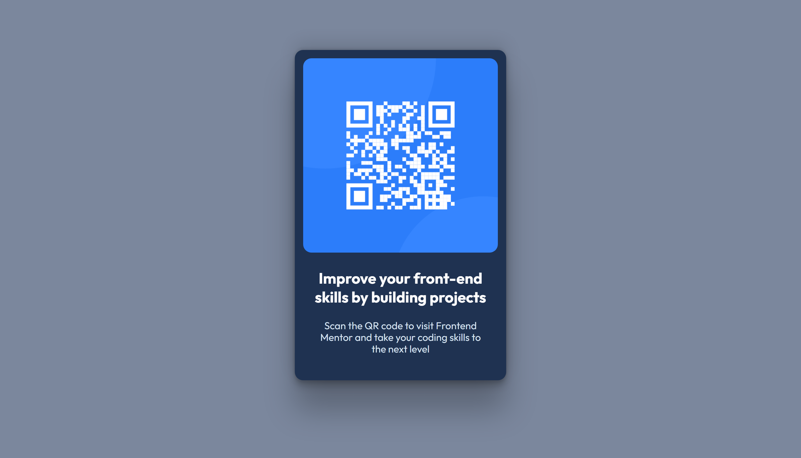

# Frontend Mentor - QR Code component solution

Essa é uma resolução para o [desafio do QR Code Component do Frontend Mentor](https://www.frontendmentor.io/challenges/qr-code-component-iux_sIO_H). Os desafios do Frontend Mentor te ajudam a aprimorar suas habilidades de código, baseado na criação de projetos realistas.

## Summary / Sumário

- [Overview / Visão geral](#overview)
  - [Screenshot](#screenshot)
  - [Links](#links)
- [My process / Meu processo](#my-process)
  - [Built with / Construido com...](#built-with)
  - [What I learned / O que aprendi](#what-i-learned)
  - [Continued development / Desenvolvimento contínuo](#continued-development)
  - [Useful resources / Recursos úteis](#useful-resources)
- [Author / Autor](#author)

## Overview

Aqui você encontrará a minha resolução do desafio do QR Code component.

### Screenshot

#### Results preview

<!-- #### Mobile result

#### Active stats

 -->

### Links

<!-- - Solution URL: [Solution link]() -->
<!-- - Live Site URL: [Live site]() -->

## My process

### Built with

- HTML 5
- CSS custom properties
- CSS @media responsivity
- Flexbox
- Mobile-first workflow

### What I learned

Nesse simples projeto, eu repliquei conceitos e reforcei conhecimentos prévios, servindo de introdução aos meus próximos desafios.

### Continued development

Esse desafio é considerado pela plataforma o inicial, e ele marca o início do meu aprendizado sobre tecnologias web. Pretendo me aprofundar mais nessa área de desenvolvimento, principalmente nas 3 ferramentas básicas, HTML, CSS e JavaScript.

### Useful resources

- [Box-shadow models](https://getcssscan.com/css-box-shadow-examples) - Esse site me auxilia muito na criação de modelos de box-shadows, que já vem prontos e me permitem ter maior criatividade na personalização de elementos.
- [CSS Gradient models](https://cssgradient.io/) - Esse é outro site que permite gerar gradientes CSS de maneira prática, possuindo até alguns modelos prontos e paletas de cores.

## Author

<!-- - Website - [@Kaua de Souza](#) -->

- Frontend Mentor - [@Kaua de Souza](https://www.frontendmentor.io/profile/SouzaSantosK)
