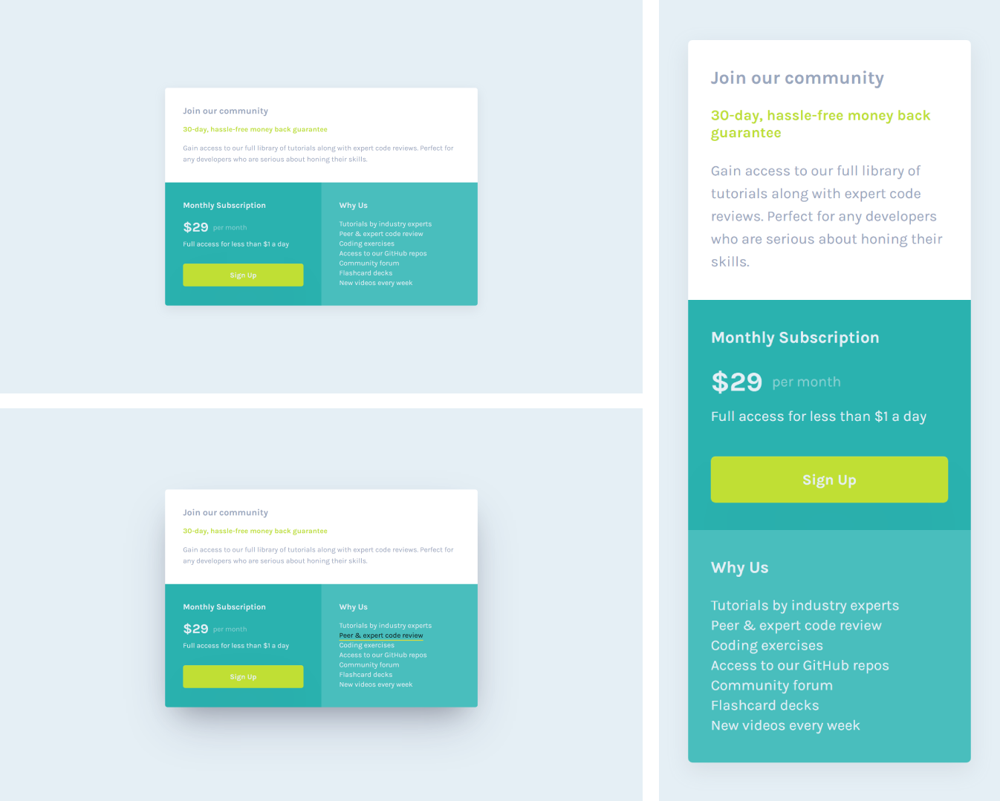

# Frontend Mentor - Single price grid component solution

Essa é uma resolução para o [desafio do Single Price Grid Card Component do Frontend Mentor](https://www.frontendmentor.io/challenges/single-price-grid-component-5ce41129d0ff452fec5abbbc). Os desafios do Frontend Mentor te ajudam a aprimorar suas habilidades de código, baseado na criação de projetos realistas.

## [📃💻 Website view 🖱🖥](https://souzasantosk.github.io/Frontend-Mentor/Single%20Price%20Grid%20Card%20Component/)

## Table of contents

- [Overview](#overview)
  - [Screenshot](#screenshot)
  - [Links](#links)
- [My process](#my-process)
  - [Built with](#built-with)
  - [What I learned](#what-i-learned)
- [Author](#author)

## Overview

Aqui você encontrará a minha resolução do desafio do Single Price Grid Card Component.

### Screenshot

### Links

- Solution URL: [Frontend Mentor](https://www.frontendmentor.io/solutions/single-price-grid-component-with-html-and-css-GnxM1IPMNI)
- Live Site URL: [Github pages](https://souzasantosk.github.io/Frontend-Mentor/Single%20Price%20Grid%20Card%20Component/)

## My process

### Built with

- Semantic HTML5 markup
- CSS custom properties
- Flexbox
- CSS Grid
- Mobile-first workflow

### What I learned

Desafio que serviu para revisão sobre posicionamentos com grid, ficou até mais simples que os outros, mas gostei do resultado.

## Author

- Github - [@SantosSouzaK](https://github.com/SouzaSantosK)
- Frontend Mentor - [@Kauã de Souza](https://www.frontendmentor.io/profile/SouzaSantosK)
