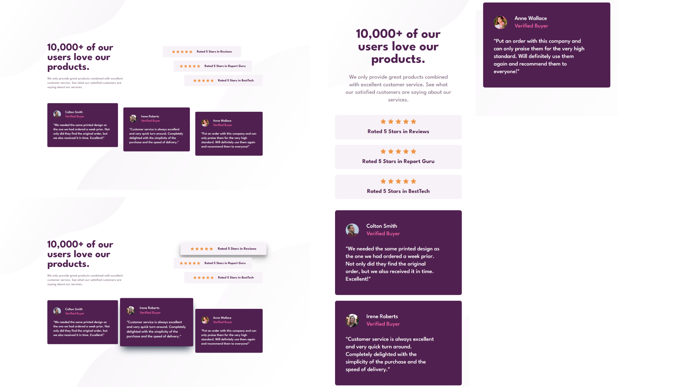

# Frontend Mentor - Social proof section solution

Essa é uma resolução para o [desafio do Social Proof Section do Frontend Mentor](https://www.frontendmentor.io/challenges/social-proof-section-6e0qTv_bA). Os desafios do Frontend Mentor te ajudam a aprimorar suas habilidades de código, baseado na criação de projetos realistas.

## [📃💻 Website view 🖱🖥](https://souzasantosk.github.io/Frontend-Mentor/Social%20Proof%20Section)

## Table of contents

- [Overview](#overview)
  - [Screenshot](#screenshot)
  - [Links](#links)
- [My process](#my-process)
  - [Built with](#built-with)
  - [What I learned](#what-i-learned)
- [Author](#author)

## Overview

### Screenshot

### Links

- Solution URL: [Frontend Mentor](https://www.frontendmentor.io/solutions/social-proof-section-with-html-and-css-e07RpxQolv)
- Live Site URL: [Github pages](https://souzasantosk.github.io/Frontend-Mentor/Social%20Proof%20Section)

## My process

### Built with

- Semantic HTML5 markup
- CSS custom properties
- Flexbox
- CSS Grid
- Mobile-first workflow

### What I learned

Esse desafio foi um pouco mais difícil, e provavelmente não vai estar parecido com o layout original, pois percebi uma dificuldade minha em relação a disposição dos elementos dentro do grid. Consegui colocar cada elemento no seu devido lugar, mas na hora de fazer o alinhamento e espaçamentos específicos entre os elementos, sinto que estão muito diferentes do original. Com isso, aprendi mais ainda sobre display grid, e suas propriedades.

## Author

- Github - [@SantosSouzaK](https://github.com/SouzaSantosK)
- Frontend Mentor - [@Kauã de Souza](https://www.frontendmentor.io/profile/SouzaSantosK)
