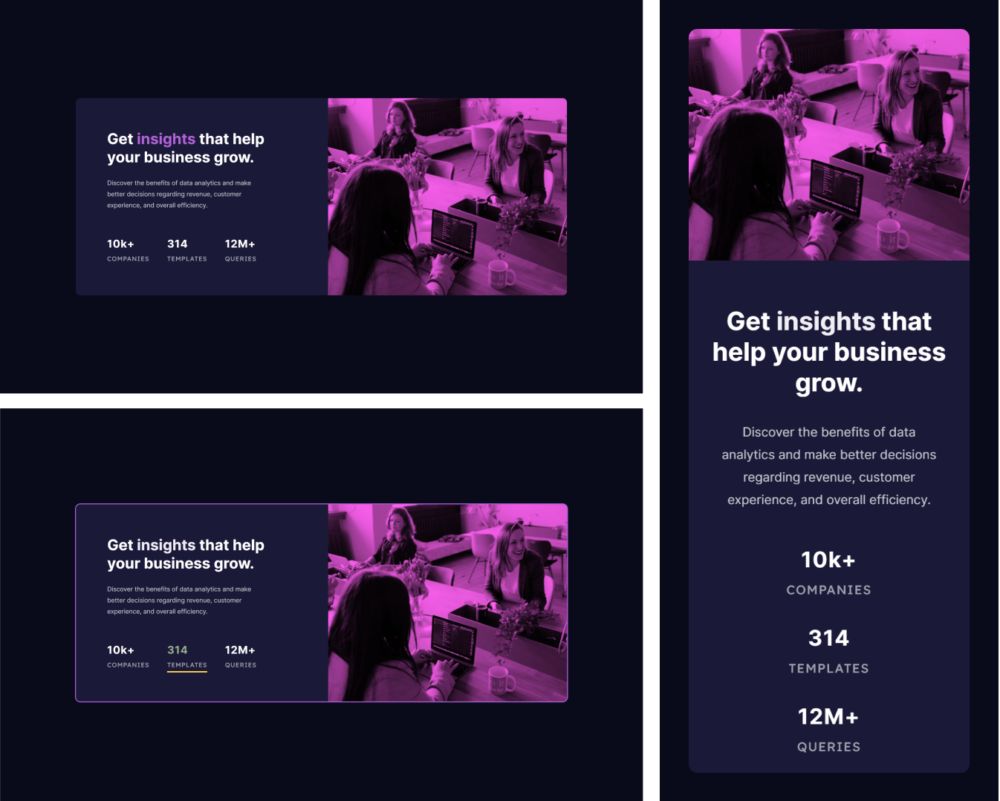

# Frontend Mentor - Product preview card component solution

Essa é uma resolução para o [desafio do Stats Card Component](https://www.frontendmentor.io/challenges/stats-preview-card-component-8JqbgoU62/hub). Os desafios do Frontend Mentor te ajudam a aprimorar suas habilidades de código, baseado na criação de projetos realistas.

## [📃💻 Website view 🖱🖥](https://souzasantosk.github.io/Frontend-Mentor/Stats%20Card%20Component/)

## Table of contents

- [Overview](#overview)
  - [Screenshot](#screenshot)
  - [Links](#links)
- [My process](#my-process)
  - [Built with](#built-with)
  - [What I learned](#what-i-learned)
  - [Useful resources](#useful-resources)
- [Author](#author)

## Overview

Aqui você encontrará a minha resolução do desafio do Stats Card component.

### Screenshot

### Links

- Solution URL: [Frontend Mentor](https://www.frontendmentor.io/solutions/stats-card-component-with-html-css-and-hover-animation-yNQ5yMU70u)
- Live Site URL: [Github pages](https://souzasantosk.github.io/Frontend-Mentor/Stats%20Card%20Component/)

## My process

### Built with

- Semantic HTML5 markup
- CSS custom properties and animations
- CSS @media responsivity
- Flexbox and Grid layout
- Mobile-first workflow

### What I learned

Esse projeto foi outro, relativamente simples. Houve um pouco de dificuldade em modificar a coloração da imagem sem usar algum programa de edição de imagem externo, mas depois de muito mexer deu certo. Foi bom porque aprendi um pouco mais sobre as propriedades de manipulação/"edição" de imagens do CSS (object-fit e position, mix-blender, filter...)

### Useful resources

- [Coolors.co](https://coolors.co/) - Site que permite gerar diversas paletas de cores, além de gradientes, de forma rápida e prática.
- [Css-tricks](https://css-tricks.com/almanac/properties/g/grid-column/) - Documentação sobre display grid, me deu uma ajudinha na hora de modificar a direção do card na hora do redimensionamento.

## Author

<!-- - Website - [@Kaua de Souza](#) -->

- Github - [@SantosSouzaK](https://github.com/SouzaSantosK)
- Frontend Mentor - [@Kauã de Souza](https://www.frontendmentor.io/profile/SouzaSantosK)
