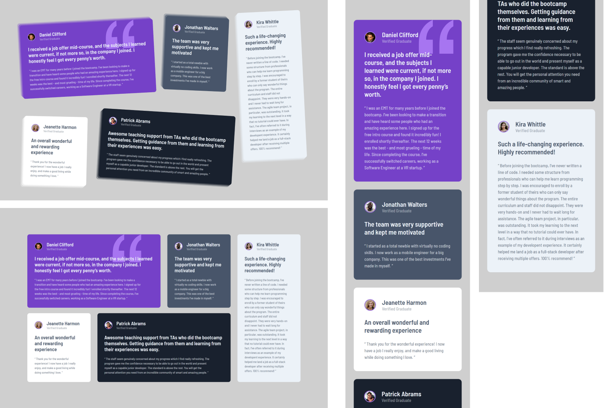

# Frontend Mentor - Testimonials grid section solution

Essa é uma resolução para o [desafio do Testimonial Grid Section do Frontend Mentor](https://www.frontendmentor.io/challenges/testimonials-grid-section-Nnw6J7Un7). Os desafios do Frontend Mentor te ajudam a aprimorar suas habilidades de código, baseado na criação de projetos realistas.

## Table of contents

- [Overview](#overview)
  - [Screenshot](#screenshot)
  - [Links](#links)
- [My process](#my-process)
  - [Built with](#built-with)
  - [What I learned](#what-i-learned)
  - [Continued development](#continued-development)
- [Author](#author)

## Overview

Aqui você encontrará a minha resolução do desafio do Testimonial Grid Section.

### Screenshot



### Links

- Solution URL: [Frontend Mentor](#)
- Live Site URL: [Github pages](https://souzasantosk.github.io/Frontend-Mentor/Testimonials%20Grid%20Section/)

## My process

### Built with

- HTML 5
- CSS custom properties
- Flexbox
- CSS Grid
- Mobile-first workflow
- @media-queries (totally responsive)

### What I learned

Nesse desafio aprofundei-me mais em como posicionar elementos usando o grid layout, mais especificamente o **grid-template-columns** o que facilitou muito a fazer a versão desktop da página. Segue o código relacionado ao grid:

```html
<main class="grid-board">
  <section class="card card-1">
    <!-- Conteúdo aqui -->
  </section>

  <section class="card card-2">
    <!-- Conteúdo aqui -->
  </section>

  <section class="card card-3">
    <!-- Conteúdo aqui -->
  </section>

  <section class="card card-4">
    <!-- Conteúdo aqui -->
  </section>

  <section class="card card-5">
    <!-- Conteúdo aqui -->
  </section>
</main>
```

```css
.grid-board {
  max-width: 1200px;
  gap: 30px;
  display: grid;
  grid-template-columns: repeat(4, 1fr);
  grid-template-areas:
    "card-1 card-1 card-2 card-5"
    "card-3 card-4 card-4 card-5";
}

.card {
  background: red; /* Cor de exemplo */
}

.card-1 {
  grid-area: card-1;
}

.card-2 {
  grid-area: card-2;
}

.card-3 {
  grid-area: card-3;
}

.card-4 {
  grid-area: card-4;
}

.card-5 {
  grid-area: card-5;
}
```

Levando em consideração as animações com hover, box-shadows, e as margens adicionadas a cada uma das tags "p" que foram adicionados, tornaram o código bem grande, o que me leva ao seguinte...

### Continued development

Nesse desafio, eu percebi que o código ficou consideravelmente maior e provavelmente cheio de partes redundantes, dito isso, meu próximo passo é aprender a reduzir partes de códigos e adotar medidas que evitem os mesmos. Além de que a sintaxe, principalmente no CSS começou a ficar confusa para quem possa lê-la no futuro.

## Author

<!-- - Website - [@Kaua de Souza](#) -->

- Github - [@SantosSouzaK](https://github.com/SouzaSantosK)
- Frontend Mentor - [@Kaua de Souza](https://www.frontendmentor.io/profile/SouzaSantosK)
